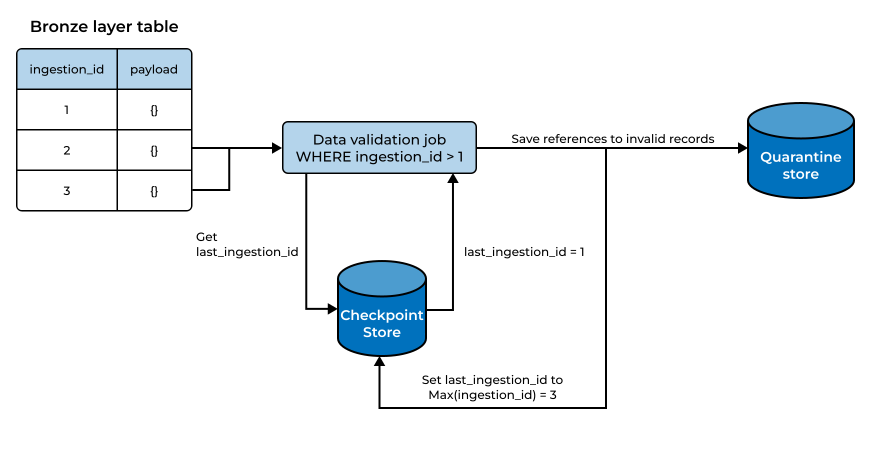

# ADR 0002: Data validation and quarantine store

## Status

Accepted

## Context

Currently, the ingestion pipeline extracts records from the source and persists them to the Bronze landing layer in their raw form.

This means that invalid records from the source are also persisted to the landing layer, which could lead to downstream issues if these records are not handled properly.

## Decision

To address this, we will implement a validation step separate from ingestion that checks the records against a defined schema before they are processed in the Silver layer. References to invalid records will be stored in a separate quarantine store. The Silver layer will only process valid records.

For each validation run:

1. Read the last validated ingestion_id from the checkpoint store.
2. Read Bronze records where ingestion_id is greater than the last validated ingestion_id.
3. Validate the JSONB payloads against the defined validation rules.
4. Write references to invalid records plus context to the quarantine store.
5. Update the validation checkpoint to the highest ingestion_id processed by the run.
6. Commit the quarantine records and checkpoint update as one transaction.



### Quarantine Table Schema

```sql
CREATE TABLE IF NOT EXISTS meta.quarantine (
    quarantine_id BIGSERIAL PRIMARY KEY,
    source_table TEXT NOT NULL,
    ingestion_id BIGINT NOT NULL,
    source_pk TEXT,
    errors JSONB NOT NULL,
    status TEXT NOT NULL DEFAULT 'open'
        CHECK (status IN ('open', 'revalidated', 'superseded', 'wont_fix')),
    quarantined_at TIMESTAMPTZ NOT NULL DEFAULT NOW(),
    resolved_at TIMESTAMPTZ,
    UNIQUE (source_table, ingestion_id),
    CHECK (
        (status = 'open' AND resolved_at IS NULL)
        OR (status != 'open' AND resolved_at IS NOT NULL)
    );
```

## Consequences

**Positive**

- Invalid records are quarantined and do not affect downstream processing.
- The validation step can be independently tested and maintained.
- The ingestion pipeline does not fail because of individual invalid records.
- Failure isolation: ingestion stays simple and reliable, while a validator failure only delays validation

**Negative**

- The pipeline can continue running even if there are many invalid records, which could hide issues in the source data. This can be mitigated by monitoring the quarantine store and alerting when the number of invalid records exceeds an acceptable threshold.

- There is a window in which records exist in Bronze but have not yet been validated.

- Additional state must be managed through a checkpoint that tracks the last validated ingestion_id per source table.

- If validation processes a large number of records in a single run, the validation workload can become larger as the Bronze backlog grows. This can be addressed later with batching if needed.

## Alternatives considered

1. **Ignore invalid records**: Invalid records would simply be ignored and not processed, which could lead to data quality issues downstream and make it difficult to identify or investigate the affected records.

2. **Fail the pipeline on invalid records**: This would ensure that invalid records prevent further processing, but the pipeline could fail because of individual bad records, potentially disrupting downstream processing.

3. **Validate records during ingestion**: The validation step would be part of the ingestion process, coupling ingestion with validation and making the components harder to test and maintain. A validation failure would cause ingestion to fail.


